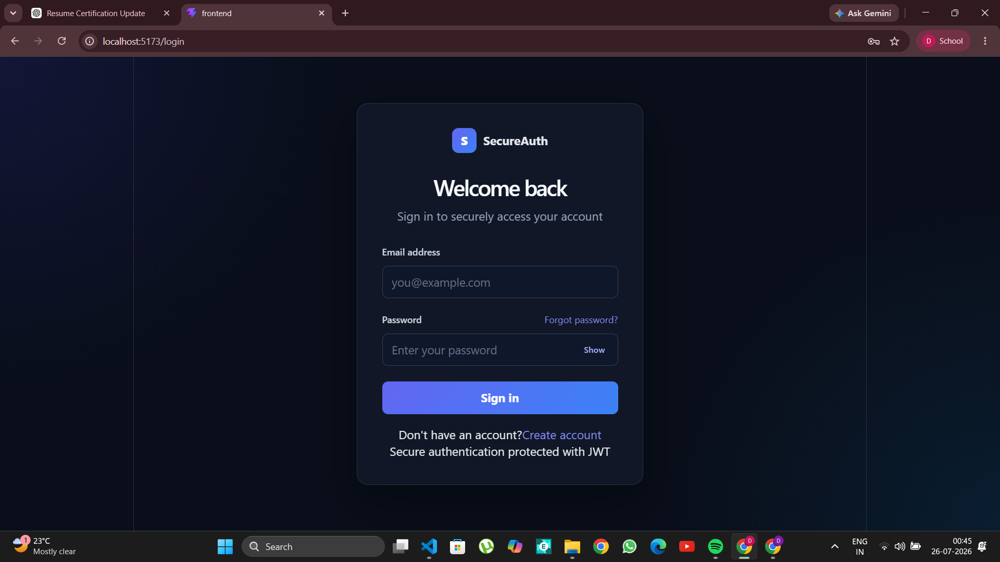
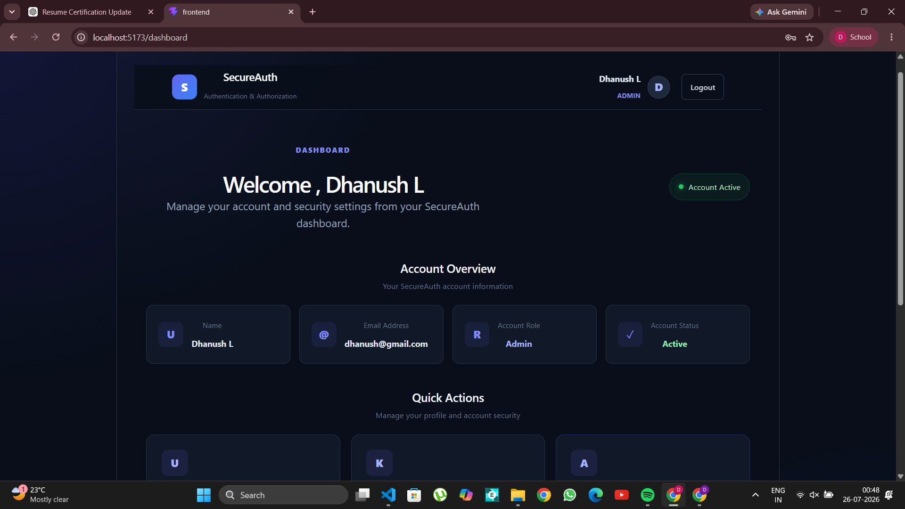
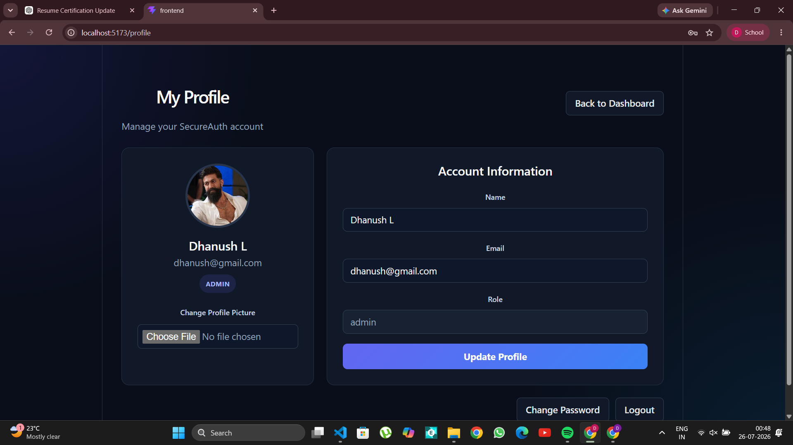
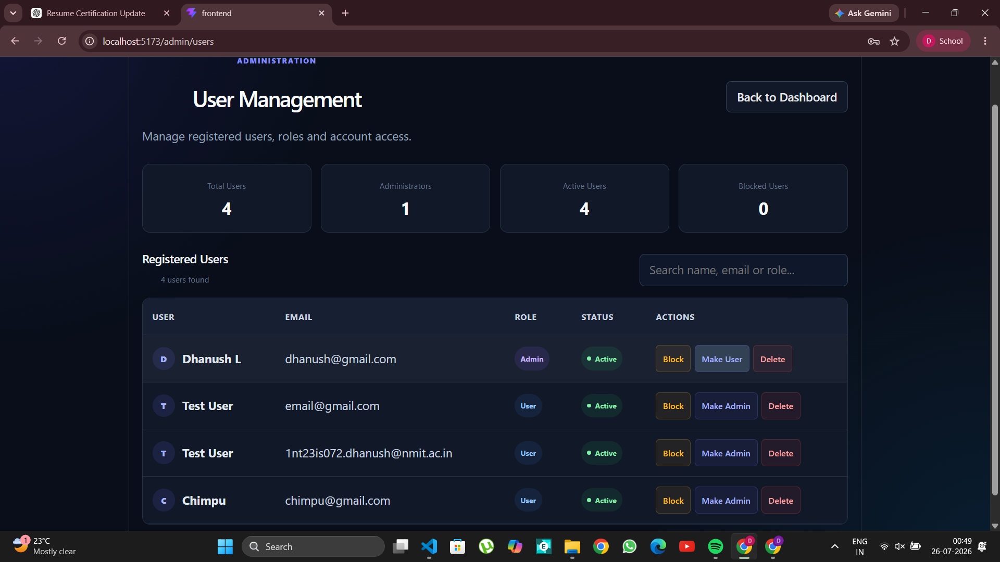

# SecureAuth – Role-Based Authentication & Authorization System

SecureAuth is a full-stack authentication and authorization system built using the MERN stack. It provides secure user authentication, role-based access control, email verification, password management, profile management, and administrative user controls.

## Features

### Authentication

- User registration and login
- JWT-based authentication
- Secure password hashing
- Protected routes
- Email verification
- Forgot password and reset password
- Change password
- Logout functionality

### User Profile

- View account information
- Update profile details
- Upload/change profile picture
- Account role and status display
- Secure account management dashboard

### Role-Based Authorization

- User and Admin roles
- Admin-only protected routes
- Role-based access control middleware
- Unauthorized access protection

### Admin User Management

- View all registered users
- Search users by name, email, or role
- View user statistics
- Promote User to Admin
- Demote Admin to User
- Block users
- Unblock users
- Delete users
- Prevent administrators from blocking or deleting their own accounts

## Tech Stack

### Frontend

- React.js
- Vite
- React Router
- Axios
- HTML5
- CSS3

### Backend

- Node.js
- Express.js
- MongoDB
- Mongoose

### Security & Authentication

- JSON Web Token (JWT)
- Password hashing
- Authentication middleware
- Role-based authorization
- Email verification
- Secure password reset flow
- Protected frontend routes
- Admin-only routes

## Project Structure

```text
secure-auth-system/
│
├── config/
│   └── db.js
│
├── controllers/
│   ├── authController.js
│   └── adminController.js
│
├── middleware/
│   ├── authMiddleware.js
│   └── uploadMiddleware.js
│
├── models/
│   └── User.js
│
├── routes/
│   ├── authRoutes.js
│   └── adminRoutes.js
│
├── utils/
│   └── sendemail.js
│
├── uploads/
│
├── screenshots/
│   ├── login.png
│   ├── dashboard.png
│   ├── profile.png
│   └── admin-users.png
│
├── frontend/
│   ├── src/
│   │   ├── components/
│   │   ├── pages/
│   │   └── services/
│   ├── package.json
│   └── vite.config.js
│
├── .env.example
├── .gitignore
├── package.json
├── server.js
└── README.md
```

## Environment Variables

Create a `.env` file in the root directory.

Use `.env.example` as the template:

```env
PORT=5000
MONGO_URI=
JWT_SECRET=
EMAIL_USER=
EMAIL_PASS=
```

Add your actual credentials only to your local `.env` file.

> Never commit the `.env` file or other credentials to GitHub.

## Installation

### 1. Clone the Repository

```bash
git clone https://github.com/dhanushl-dev/user-autentication.git
cd user-autentication
```

### 2. Install Backend Dependencies

```bash
npm install
```

### 3. Install Frontend Dependencies

```bash
cd frontend
npm install
```

### 4. Configure Environment Variables

Create a `.env` file in the root directory and add the required environment variables.

Example:

```env
PORT=5000
MONGO_URI=your_mongodb_connection_string
JWT_SECRET=your_jwt_secret
EMAIL_USER=your_email
EMAIL_PASS=your_email_app_password
```

Do not commit these real values to GitHub.

### 5. Start the Backend

Go to the root directory and run:

```bash
npm run dev
```

### 6. Start the Frontend

Open another terminal:

```bash
cd frontend
npm run dev
```

The frontend will normally run on:

```text
http://localhost:5173
```

The backend will normally run on:

```text
http://localhost:5000
```

## Application Screenshots

### Login Page



### User Dashboard



### User Profile



### Admin User Management



## Security

SecureAuth implements multiple security mechanisms including:

- Hashed passwords instead of plain-text password storage
- JWT-based authentication
- Backend authentication middleware
- Role-based authorization
- Admin-only route protection
- Frontend protected routes
- Email verification before account access
- Secure password reset flow
- User blocking controls
- Environment variables for sensitive credentials

## Main User Flow

```text
Register
   ↓
Email Verification
   ↓
Login
   ↓
JWT Authentication
   ↓
Dashboard
   ↓
Profile / Change Password
```

Admin users additionally have access to:

```text
Admin Dashboard
      ↓
User Management
      ↓
View / Search Users
      ↓
Block / Unblock
      ↓
Change Roles
      ↓
Delete Users
```

## Future Improvements

- Two-factor authentication (2FA)
- Google OAuth authentication
- Login activity history
- Refresh token implementation
- Rate limiting
- Account security notifications
- Production deployment

## Author

**Dhanush L**

Information Science Engineering  
Nitte Meenakshi Institute of Technology

## License

This project is developed for educational and portfolio purposes. 